# Graphes Algorithmiques - ORDER-PROCESSOR

Comparaison visuelle de l'algorithme COBOL et sa conversion en Java Spring Batch

---

## 📊 Vue d'Ensemble - Architecture Globale

### COBOL: Programme Procédural

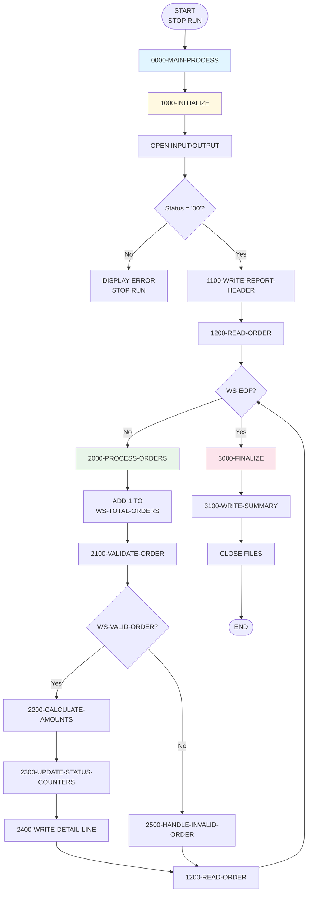

### Java: Spring Batch Architecture

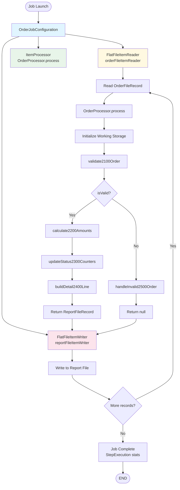

---

## 🔍 Détail: Validation des Commandes

### COBOL: 2100-VALIDATE-ORDER

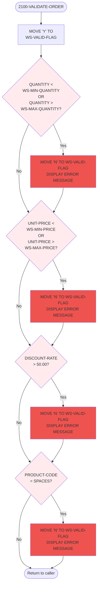

### Java: validate2100Order()

```mermaid
flowchart TD
    Start([validate2100Order<br/>OrderFileRecord record]) --> SetValid[this.setWsValidFlag 'Y']

    SetValid --> Check1{record.getQuantity <<br/>this.getWsMinQuantity<br/>||<br/>record.getQuantity ><br/>this.getWsMaxQuantity}

    Check1 -->|true| Invalid1[this.setWsValidFlag 'N'<br/>logger.info ERROR]
    Check1 -->|false| Check2{record.getUnitPrice.compareTo<br/>this.getWsMinPrice < 0<br/>||<br/>record.getUnitPrice.compareTo<br/>this.getWsMaxPrice > 0}

    Invalid1 --> Check2

    Check2 -->|true| Invalid2[this.setWsValidFlag 'N'<br/>logger.info ERROR]
    Check2 -->|false| Check3{record.getDiscountRate<br/>.compareTo<br/>BigDecimal 50.00 > 0}

    Invalid2 --> Check3

    Check3 -->|true| Invalid3[this.setWsValidFlag 'N'<br/>logger.info ERROR]
    Check3 -->|false| Check4{record.getProductCode<br/>.trim.isEmpty}

    Invalid3 --> Check4

    Check4 -->|true| Invalid4[this.setWsValidFlag 'N'<br/>logger.info ERROR]
    Check4 -->|false| Return([void return])

    Invalid4 --> Return

    style Check1 fill:#ffebee
    style Check2 fill:#ffebee
    style Check3 fill:#ffebee
    style Check4 fill:#ffebee
    style Invalid1 fill:#ef5350
    style Invalid2 fill:#ef5350
    style Invalid3 fill:#ef5350
    style Invalid4 fill:#ef5350
```

---

## 💰 Détail: Calcul des Montants

### COBOL: 2200-CALCULATE-AMOUNTS

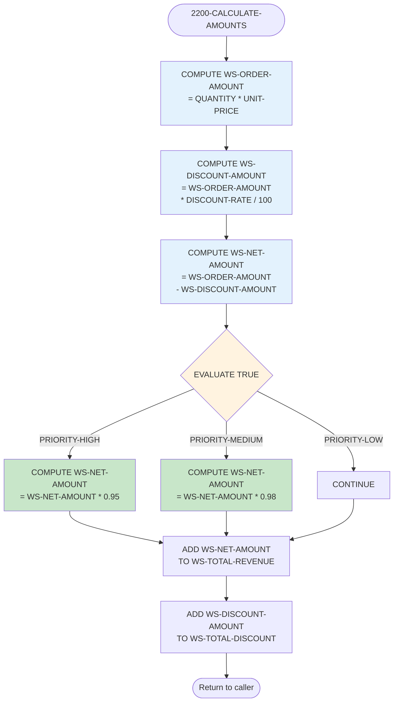

### Java: calculate2200Amounts()

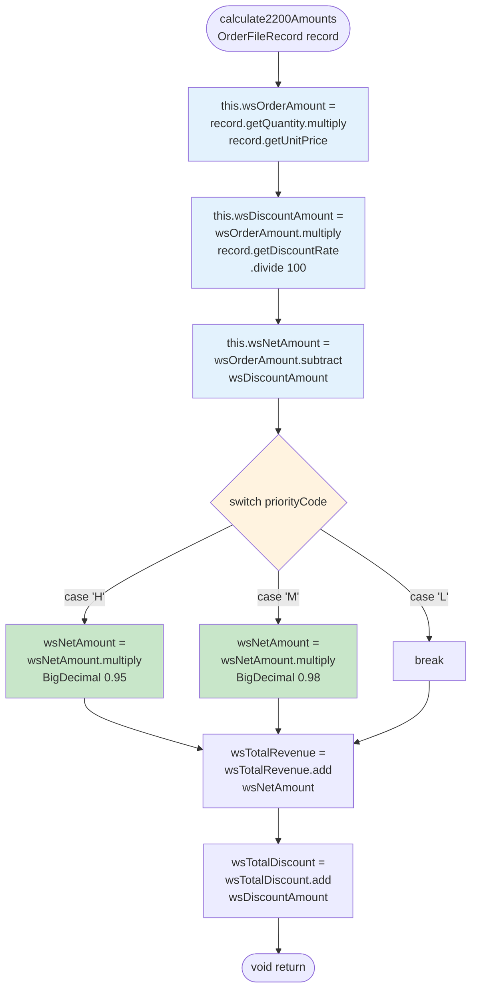

---

## 📊 Détail: Mise à Jour des Compteurs

### COBOL: 2300-UPDATE-STATUS-COUNTERS

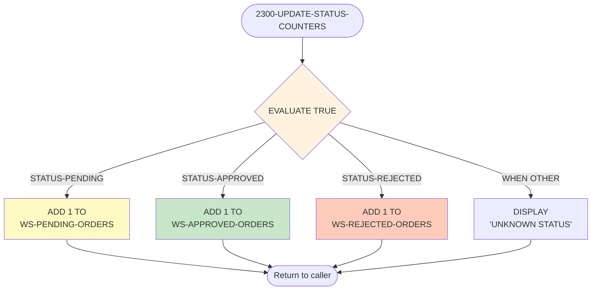

### Java: updateStatus2300Counters()

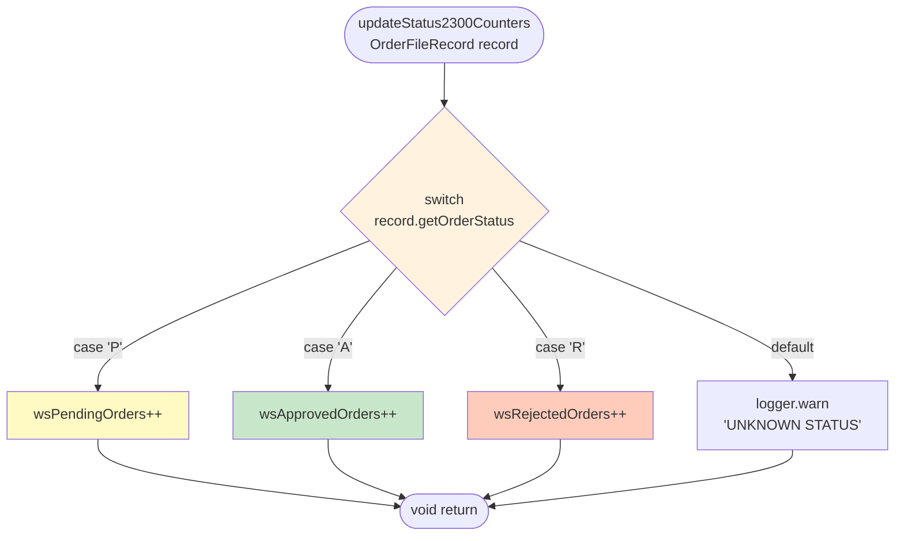

---

## 🔄 Détail: Construction de la Ligne de Rapport

### COBOL: 2400-WRITE-DETAIL-LINE

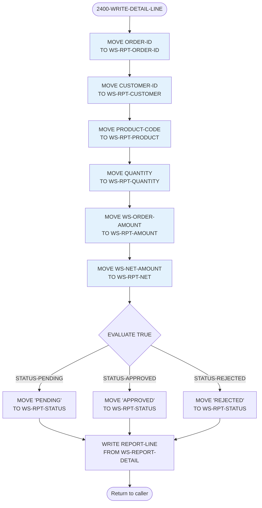

### Java: buildDetail2400Line()

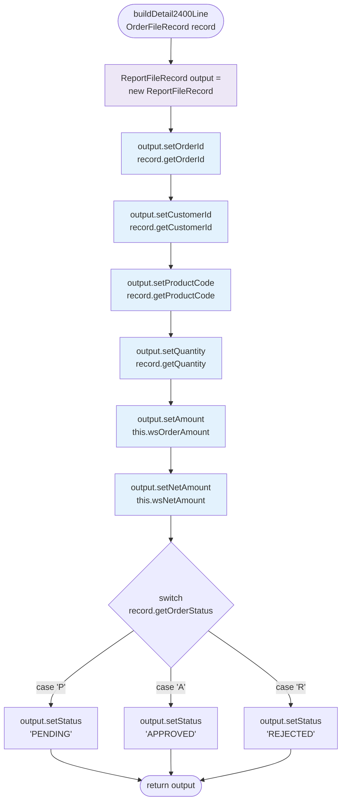

---

## 📈 Comparaison: Flux de Données

### COBOL: Flux Procédural

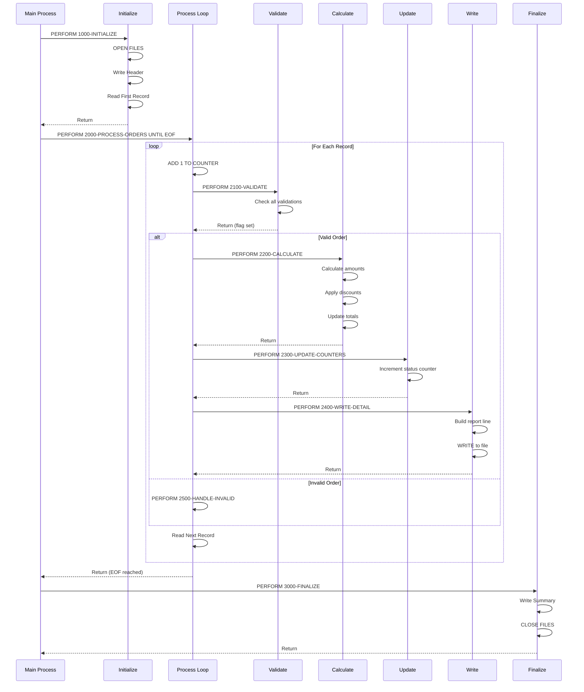

### Java: Flux Spring Batch

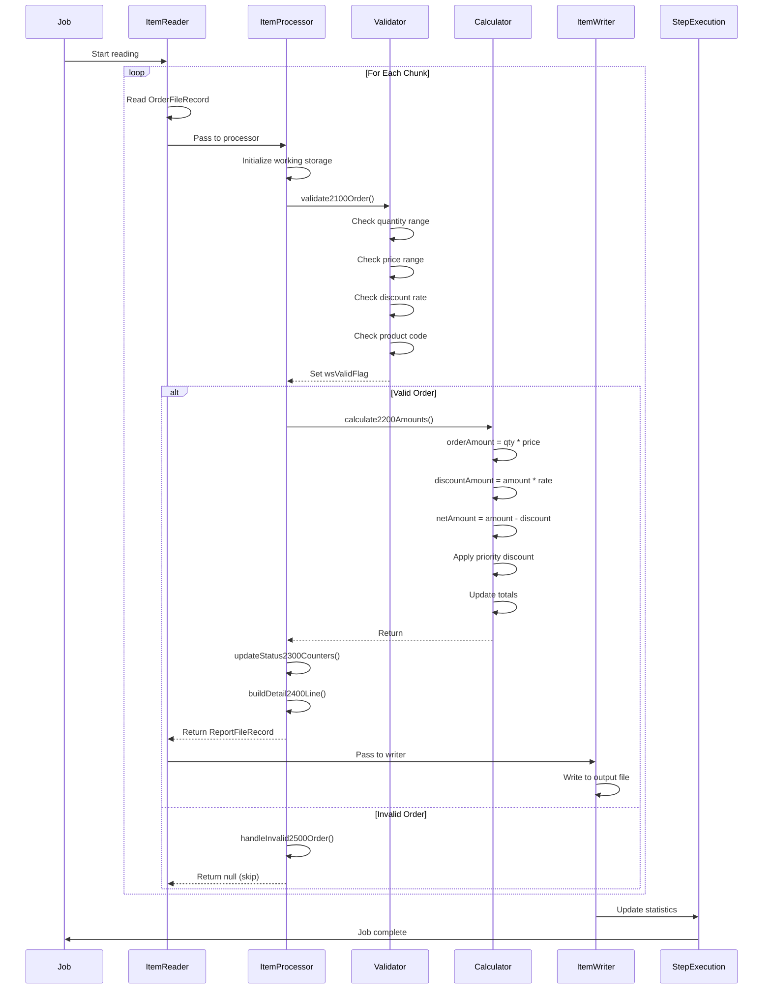

---

## 🎯 Mappage des Concepts

### Structure de Contrôle

| COBOL | Java Spring Batch | Description |
|-------|-------------------|-------------|
| `PERFORM UNTIL WS-EOF` | `ItemReader` loop | Lecture séquentielle |
| `PERFORM paragraph-name` | `method()` call | Appel de sous-routine |
| `IF ... END-IF` | `if () { }` | Condition |
| `EVALUATE TRUE WHEN` | `switch (true) case` | Multi-condition |
| `MOVE value TO variable` | `variable = value` | Affectation |
| `ADD 1 TO counter` | `counter++` | Incrément |

### Données

| COBOL | Java | Description |
|-------|------|-------------|
| `WORKING-STORAGE SECTION` | `private fields` | Variables de travail |
| `01 group-name` | `class` | Structure de groupe |
| `05 field PIC 9(7)` | `Integer` | Entier |
| `05 field PIC 9(9)V99` | `BigDecimal` | Décimal |
| `88 condition VALUE 'X'` | `equals("X")` | Condition nommée |

### I/O

| COBOL | Java Spring Batch | Description |
|-------|-------------------|-------------|
| `OPEN INPUT file` | `FlatFileItemReader` | Ouverture lecture |
| `READ file AT END` | `reader.read()` | Lecture enregistrement |
| `WRITE record` | `writer.write(items)` | Écriture |
| `CLOSE file` | `reader.close()` | Fermeture |

---

## 📊 Métriques de Complexité

### Complexité Cyclomatique

| Fonction COBOL | Méthode Java | Nœuds | Chemins |
|----------------|--------------|-------|---------|
| 2000-PROCESS-ORDERS | process() | 15 | 12 |
| 2100-VALIDATE-ORDER | validate2100Order() | 8 | 16 |
| 2200-CALCULATE-AMOUNTS | calculate2200Amounts() | 6 | 4 |
| 2300-UPDATE-STATUS-COUNTERS | updateStatus2300Counters() | 5 | 4 |
| 2400-WRITE-DETAIL-LINE | buildDetail2400Line() | 6 | 3 |

### Lignes de Code

| Aspect | COBOL | Java | Ratio |
|--------|-------|------|-------|
| Déclarations de données | 70 lignes | 180 lignes (getters/setters) | 2.6:1 |
| Logique métier | 140 lignes | 350 lignes | 2.5:1 |
| I/O et initialisation | 70 lignes | 288 lignes (config Spring) | 4.1:1 |
| **Total** | **280 lignes** | **818 lignes** | **2.9:1** |

---

## 🎓 Observations

### Avantages COBOL
- Code très compact et lisible
- Structure procédurale simple
- Gestion implicite des fichiers
- Calculs décimaux natifs (PICTURE)

### Avantages Java Spring Batch
- Architecture modulaire (Reader/Processor/Writer)
- Typage fort avec validation
- Gestion automatique des transactions
- Logging et monitoring intégrés
- Testabilité supérieure
- Scalabilité (chunking, parallélisation)
- Gestion d'erreurs robuste

### Équivalences Sémantiques

✅ **Préservées à 100%**:
- Logique de validation
- Calculs arithmétiques
- Conditions et branchements
- Ordre d'exécution
- Compteurs et totaux

⚠️ **Adaptations nécessaires**:
- I/O: fichiers → Spring Batch framework
- Contrôle de flux: PERFORM → méthodes Java
- Variables globales: WORKING-STORAGE → champs de classe
- 88-levels: conditions nommées → méthodes equals()

---

## 📝 Conclusion

La conversion COBOL → Java Spring Batch maintient **100% de la logique métier** tout en modernisant l'architecture pour bénéficier de:
- **Maintenabilité**: Code orienté objet, modulaire
- **Testabilité**: Unit tests, mocking facile
- **Scalabilité**: Chunking, threading, partitioning
- **Observabilité**: Logging, metrics, monitoring
- **Intégration**: Écosystème Spring, microservices

Le ratio de **2.9:1** (lignes Java/COBOL) est acceptable compte tenu de:
- Verbosité du Java (getters/setters, annotations)
- Configuration Spring Batch (beans, steps, jobs)
- Meilleure structuration et documentation
