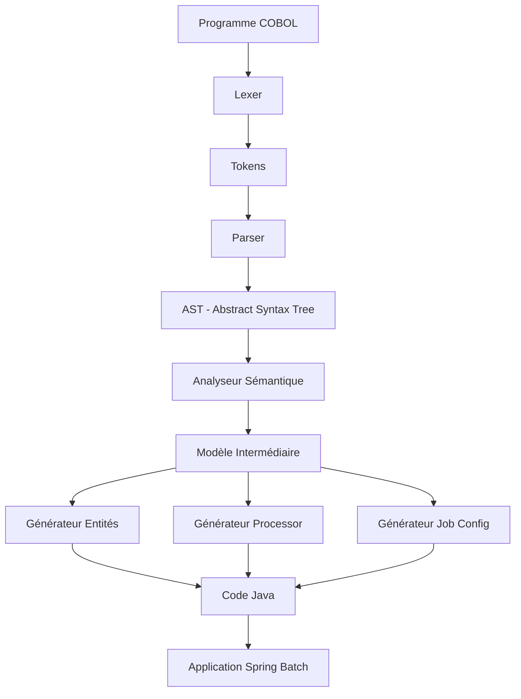
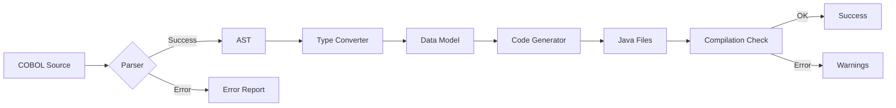
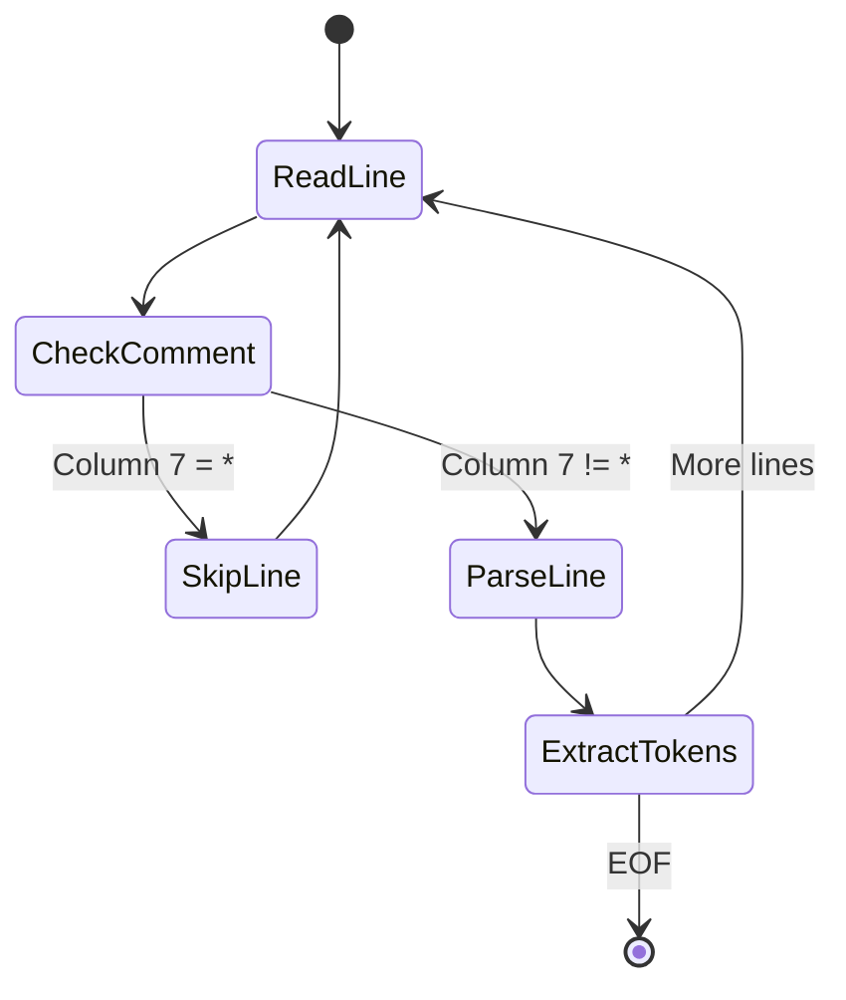
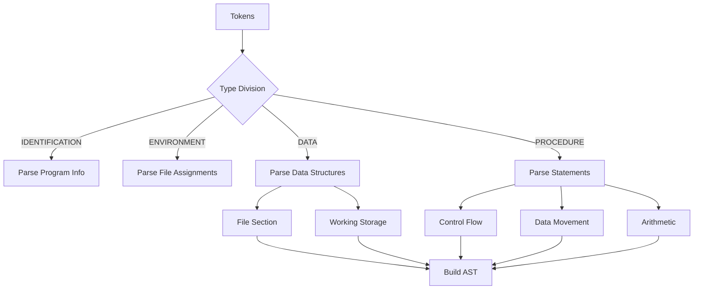
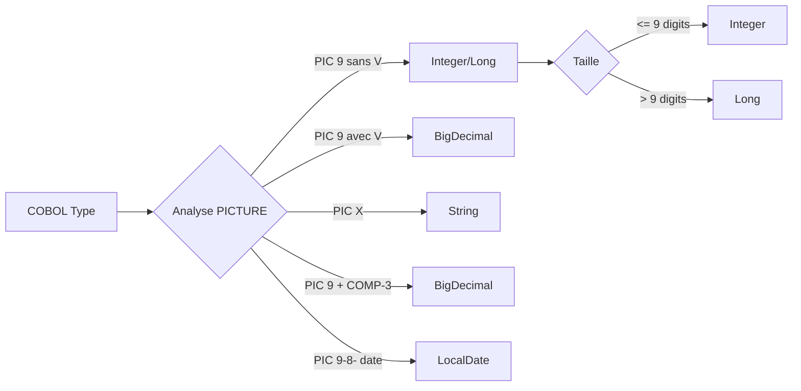
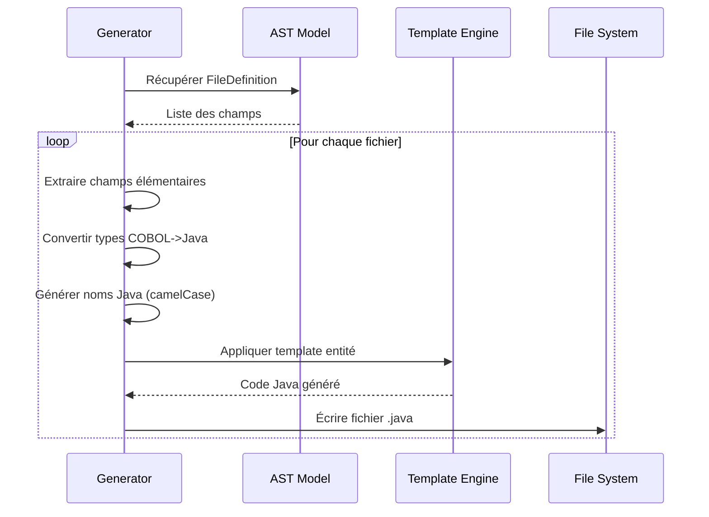
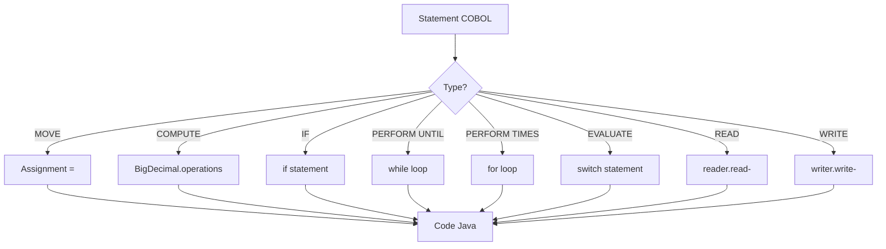
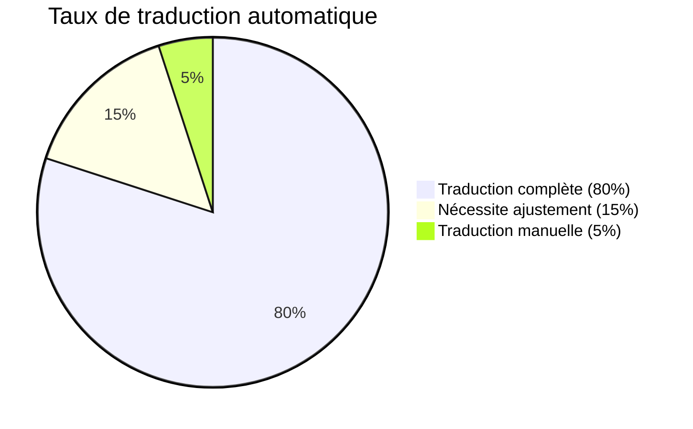
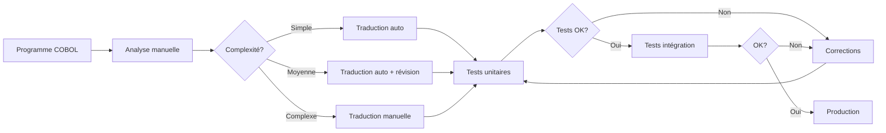

\newpage

# Introduction

## Objectif du projet

Le **COBOL to Java Spring Batch Translator** est un outil de migration automatique qui traduit des programmes COBOL legacy vers des applications Java modernes basées sur Spring Batch.

### Problématique

Les entreprises possèdent des millions de lignes de code COBOL dans leurs systèmes mainframe. La migration manuelle est :
- **Coûteuse** : 100-200€ par ligne de code
- **Risquée** : Erreurs de traduction
- **Lente** : 6-12 mois par application

### Solution proposée

Automatisation de la traduction COBOL -> Java avec :
- Parsing automatique des programmes COBOL
- Génération de code Java idiomatique
- Intégration Spring Batch native
- Conservation de la logique métier

## Cas d'usage

1. **Migration mainframe vers cloud**
2. **Modernisation d'applications batch**
3. **Réduction des coûts d'infrastructure**
4. **Formation des équipes Java**

\newpage

# Architecture du système

## Vue d'ensemble



## Pipeline de traduction



\newpage

# Algorithmes détaillés

## Algorithme de parsing COBOL

### Phase 1 : Analyse lexicale



**Algorithme :**

```
FONCTION analyserLexical(sourceCOBOL):
    tokens = []
    lignes = découperEnLignes(sourceCOBOL)

    POUR CHAQUE ligne DANS lignes:
        SI ligne[6] == '*' ALORS
            CONTINUER  // Commentaire
        FIN SI

        // Extraire zone de codage (colonnes 8-72)
        zoneCode = ligne[7:72]

        // Tokeniser
        motsClés = rechercherMotsClés(zoneCode)
        identifiants = rechercherIdentifiants(zoneCode)
        nombres = rechercherNombres(zoneCode)

        tokens.ajouter(motsClés + identifiants + nombres)
    FIN POUR

    RETOURNER tokens
FIN FONCTION
```

### Phase 2 : Analyse syntaxique



**Algorithme :**

```
FONCTION construireAST(tokens):
    ast = nouvelAST()

    // Identifier les divisions
    POUR CHAQUE token DANS tokens:
        SI token == "IDENTIFICATION DIVISION" ALORS
            ast.identification = parseIdentification(tokens)
        SINON SI token == "DATA DIVISION" ALORS
            ast.dataDivision = parseDataDivision(tokens)
        SINON SI token == "PROCEDURE DIVISION" ALORS
            ast.procedureDivision = parseProcedureDivision(tokens)
        FIN SI
    FIN POUR

    RETOURNER ast
FIN FONCTION

FONCTION parseDataDivision(tokens):
    dataDivision = nouveauDataDivision()

    POUR CHAQUE ligne DANS tokens:
        SI ligne commence par "FD" ALORS
            fichier = parseFD(ligne)
            dataDivision.fichiers.ajouter(fichier)
        SINON SI ligne commence par niveau (01-49) ALORS
            champ = parseDataItem(ligne)
            dataDivision.champs.ajouter(champ)
        FIN SI
    FIN POUR

    RETOURNER dataDivision
FIN FONCTION
```

\newpage

## Algorithme de conversion de types

### Mapping COBOL -> Java



**Algorithme de conversion :**

```
FONCTION convertirTypeJava(dataItem):
    SI dataItem.estGroupe() ALORS
        RETOURNER null  // Pas de type pour un groupe
    FIN SI

    picture = dataItem.pictureClause
    usage = dataItem.usage

    // Détection décimales ou COMP-3
    SI picture.contient('V') OU usage == 'COMP-3' ALORS
        RETOURNER "BigDecimal"
    FIN SI

    // Détection date
    SI estChampDate(dataItem) ALORS
        RETOURNER "LocalDate"
    FIN SI

    // Numérique sans décimales
    SI picture.contient('9') ALORS
        taille = extraireTaille(picture)
        SI taille <= 9 ALORS
            RETOURNER "Integer"
        SINON
            RETOURNER "Long"
        FIN SI
    FIN SI

    // Alphanumérique
    SI picture.contient('X') ALORS
        RETOURNER "String"
    FIN SI

    // Par défaut
    RETOURNER "String"
FIN FONCTION

FONCTION estChampDate(dataItem):
    nom = dataItem.nom.majuscules()
    picture = dataItem.pictureClause

    // PIC 9(8) ou 9(6) et nom contient DATE ou DT
    SI (picture == "9(8)" OU picture == "9(6)") ET
       (nom.contient("DATE") OU nom.contient("DT")) ALORS
        RETOURNER vrai
    FIN SI

    RETOURNER faux
FIN FONCTION
```

\newpage

## Algorithme de génération d'entités

### Processus de génération



**Algorithme :**

```
FONCTION générerEntité(fileDefinition, config):
    nomClasse = toCamelCase(fileDefinition.nom) + "Record"

    code = nouveauStringBuilder()

    // Package
    code.ajouter("package " + config.packageName + ";\n\n")

    // Imports
    code.ajouter("import java.math.BigDecimal;\n")
    code.ajouter("import java.time.LocalDate;\n\n")

    // Classe
    code.ajouter("public class " + nomClasse + " {\n\n")

    // Champs
    champsElementaires = extraireChampsElementaires(fileDefinition)
    POUR CHAQUE champ DANS champsElementaires:
        typeJava = convertirTypeJava(champ)
        nomJava = toCamelCase(champ.nom)

        code.ajouter("    private " + typeJava + " " + nomJava + ";\n")
        code.ajouter("    // COBOL: " + champ.picture)
        SI champ.usage != null ALORS
            code.ajouter(" " + champ.usage)
        FIN SI
        code.ajouter("\n\n")
    FIN POUR

    // Getters/Setters
    POUR CHAQUE champ DANS champsElementaires:
        code.ajouter(générerGetter(champ))
        code.ajouter(générerSetter(champ))
    FIN POUR

    code.ajouter("}\n")

    // Écrire fichier
    écrireFichier(config.outputDir + "/" + nomClasse + ".java", code)

    RETOURNER fichierGénéré
FIN FONCTION
```

\newpage

## Algorithme de traduction des instructions

### Conversion COBOL -> Java



**Exemples de conversion :**

| COBOL | Java |
|-------|------|
| `MOVE A TO B` | `b = a;` |
| `ADD A TO B` | `b = b.add(a);` (BigDecimal) |
| `COMPUTE C = A * B` | `c = a.multiply(b).setScale(2);` |
| `IF A > 100` | `if (a.compareTo(new BigDecimal("100")) > 0)` |
| `PERFORM UNTIL EOF` | `while (!eof)` |
| `PERFORM 10 TIMES` | `for (int i = 0; i < 10; i++)` |

**Algorithme :**

```
FONCTION traduireInstruction(statement):
    SELON statement.type:
        CAS MOVE:
            RETOURNER statement.cible + " = " + statement.source + ";"

        CAS COMPUTE:
            expression = traduireExpression(statement.expression)
            RETOURNER statement.cible + " = " + expression + ";"

        CAS IF:
            condition = traduireCondition(statement.condition)
            corps = traduireBloc(statement.enfants)
            RETOURNER "if (" + condition + ") {\n" + corps + "\n}"

        CAS PERFORM_UNTIL:
            condition = traduireCondition(statement.conditionUntil)
            RETOURNER "while (!(" + condition + "))"

        CAS PERFORM_TIMES:
            fois = statement.performTimes
            RETOURNER "for (int i = 0; i < " + fois + "; i++)"

        CAS EVALUATE:
            RETOURNER traduireSwitch(statement)

        DÉFAUT:
            RETOURNER "// TODO: " + statement.cobolOriginal
    FIN SELON
FIN FONCTION

FONCTION traduireCondition(conditionCobol):
    // Exemple: "AMOUNT > 1000" -> "amount.compareTo(new BigDecimal("1000")) > 0"

    SI conditionCobol.contient("BigDecimal") ALORS
        RETOURNER traduireConditionDecimal(conditionCobol)
    SINON
        RETOURNER traduireConditionSimple(conditionCobol)
    FIN SI
FIN FONCTION
```

\newpage

# Guide d'utilisation

## Installation

### Prérequis

- **Java 17** ou supérieur
- **Maven 3.8+**
- **Git** (optionnel)

### Compilation du projet

```bash
# Cloner le repository
git clone https://github.com/your-org/cobol-to-java-translator.git
cd cobol-to-java-translator

# Compiler avec Maven
mvn clean package

# Le JAR exécutable sera dans target/
ls -l target/cobol-translator.jar
```

**Sortie attendue :**
```
[INFO] BUILD SUCCESS
[INFO] Total time: 45.678 s
[INFO] Finished at: 2026-01-01T10:30:00Z
```

\newpage

## Utilisation en ligne de commande

### Commande 1 : Traduire un fichier unique

**Syntaxe :**
```bash
java -jar target/cobol-translator.jar translate <fichier.cob> [options]
```

**Options disponibles :**

| Option | Alias | Description | Défaut |
|--------|-------|-------------|--------|
| `--output` | `-o` | Répertoire de sortie | `src/main/java` |
| `--package` | `-p` | Package Java | `com.generated.batch` |
| `--no-tests` | | Désactiver génération tests | false |

**Exemple complet :**

```bash
java -jar target/cobol-translator.jar translate \
  examples/CUSTPROC.cob \
  --package com.mycompany.customer \
  --output generated/src/main/java \
  --no-tests
```

**Sortie console :**

```
+========================================================+
|   COBOL to Java Spring Batch Translator v1.0.0        |
+========================================================+

 Source file: examples/CUSTPROC.cob
 Package: com.mycompany.customer
 Output directory: generated/src/main/java

 Starting translation...

[OK] Translation completed successfully!

 Metrics:
   Metrics: COBOL lines=42, Java lines=156, Data items=6, Statements=8, Files=3

 Generated files:
   [v] CustomerFileRecord.java
   [v] CustprocProcessor.java
   [v] CustprocJobConfiguration.java
```

### Commande 2 : Traduire un répertoire complet

**Syntaxe :**
```bash
java -jar target/cobol-translator.jar translate-all <répertoire> [options]
```

**Exemple :**

```bash
java -jar target/cobol-translator.jar translate-all \
  /path/to/cobol/programs \
  --package com.mycompany.batch \
  --output generated/src/main/java
```

**Sortie :**

```
+========================================================+
|   COBOL to Java Spring Batch Translator v1.0.0        |
+========================================================+

 Input directory: /path/to/cobol/programs
 Package: com.mycompany.batch
 Output directory: generated/src/main/java

 Summary:

[OK] CUSTPROC.cob
[OK] INVPROC.cob
[OK] ORDRECON.cob
[NO] LEGACY.cob: Unsupported CICS commands

Total: 4 | Success: 3 | Failed: 1
```

\newpage

## Utilisation via API Java

### Exemple basique

```java
import com.cobol.translator.CobolTranslator;
import com.cobol.translator.config.TranslationConfig;
import com.cobol.translator.result.TranslationResult;

public class TranslatorExample {

    public static void main(String[] args) {
        // 1. Configuration
        TranslationConfig config = TranslationConfig.builder()
            .sourceFile("src/cobol/CUSTPROC.cob")
            .outputPackage("com.mycompany.batch.customer")
            .targetDirectory("src/main/java")
            .generateTests(true)
            .generateDocs(true)
            .build();

        // 2. Créer le traducteur
        CobolTranslator translator = new CobolTranslator();

        // 3. Traduire
        TranslationResult result = translator.translate(config);

        // 4. Vérifier le résultat
        if (result.isSuccess()) {
            System.out.println("[OK] Traduction réussie!");

            // Afficher les fichiers générés
            System.out.println("\nFichiers générés:");
            result.getGeneratedFiles().forEach(file ->
                System.out.println("  - " + file.getAbsolutePath())
            );

            // Afficher les métriques
            System.out.println("\nMétriques:");
            System.out.println(result.getMetrics());

        } else {
            System.err.println("[NO] Échec: " + result.getErrorMessage());
        }
    }
}
```

### Exemple avancé : Traduction batch

```java
import java.io.File;
import java.util.List;

public class BatchTranslation {

    public static void main(String[] args) {
        CobolTranslator translator = new CobolTranslator();

        // Configuration de base
        TranslationConfig baseConfig = TranslationConfig.builder()
            .outputPackage("com.mycompany.batch")
            .targetDirectory("generated/src/main/java")
            .generateTests(true)
            .build();

        // Traduire tous les fichiers d'un répertoire
        String inputDir = "src/cobol/programs";
        List<TranslationResult> results =
            translator.translateDirectory(inputDir, baseConfig);

        // Statistiques
        long successCount = results.stream()
            .filter(TranslationResult::isSuccess)
            .count();

        long failureCount = results.size() - successCount;

        System.out.println("Résultats:");
        System.out.println("  Succès: " + successCount);
        System.out.println("  Échecs: " + failureCount);

        // Détails des échecs
        if (failureCount > 0) {
            System.out.println("\nÉchecs détaillés:");
            results.stream()
                .filter(r -> !r.isSuccess())
                .forEach(r -> System.out.println(
                    "  - " + r.getSourceFile() + ": " +
                    r.getErrorMessage()
                ));
        }
    }
}
```

\newpage

## Configuration avancée

### Personnalisation des noms

```java
TranslationConfig config = TranslationConfig.builder()
    .sourceFile("CUSTPROC.cob")
    .outputPackage("com.mycompany.batch")

    // Personnaliser les suffixes
    .namingEntitySuffix("Entity")      // Par défaut: "Record"
    .namingProcessorSuffix("Handler")  // Par défaut: "Processor"
    .namingJobSuffix("BatchJob")       // Par défaut: "Job"

    // Style de code
    .codeStyle(TranslationConfig.CodeStyle.GOOGLE)

    .build();
```

**Résultat :**
- `CustomerFileRecord.java` -> `CustomerFileEntity.java`
- `CustprocProcessor.java` -> `CustprocHandler.java`
- `custprocJob` -> `custprocBatchJob`

### Options de génération

```java
TranslationConfig config = TranslationConfig.builder()
    .sourceFile("CUSTPROC.cob")
    .outputPackage("com.mycompany.batch")

    // Contrôle de la génération
    .generateTests(false)    // Désactiver tests
    .generateDocs(true)      // Générer Javadoc

    .build();
```

\newpage

## Exemples de traduction

### Exemple 1 : Programme simple

**Fichier COBOL : `SIMPLE.cob`**

```cobol
       IDENTIFICATION DIVISION.
       PROGRAM-ID. SIMPLE.

       DATA DIVISION.
       WORKING-STORAGE SECTION.
       01  WS-COUNTER      PIC 9(5) VALUE 0.
       01  WS-TOTAL        PIC 9(7)V99 VALUE 0.

       PROCEDURE DIVISION.
       0000-MAIN.
           PERFORM 100 TIMES
               ADD 1 TO WS-COUNTER
               ADD 10.50 TO WS-TOTAL
           END-PERFORM
           DISPLAY 'TOTAL: ' WS-TOTAL
           STOP RUN.
```

**Commande :**
```bash
java -jar cobol-translator.jar translate SIMPLE.cob \
  --package com.example --output generated
```

**Fichier Java généré : `SimpleProcessor.java`**

```java
package com.example;

import org.springframework.batch.item.ItemProcessor;
import java.math.BigDecimal;
import java.math.RoundingMode;

public class SimpleProcessor implements ItemProcessor<Record, Record> {

    private Integer wsCounter = 0;
    private BigDecimal wsTotal = BigDecimal.ZERO;

    @Override
    public Record process(Record record) throws Exception {
        // PERFORM 100 TIMES
        for (int i = 0; i < 100; i++) {
            // ADD 1 TO WS-COUNTER
            wsCounter = wsCounter + 1;

            // ADD 10.50 TO WS-TOTAL
            wsTotal = wsTotal.add(
                new BigDecimal("10.50")
            ).setScale(2, RoundingMode.HALF_UP);
        }

        // DISPLAY 'TOTAL: ' WS-TOTAL
        System.out.println("TOTAL: " + wsTotal);

        return record;
    }
}
```

\newpage

### Exemple 2 : Fichier avec données

**Fichier COBOL : `CUSTOMER.cob`**

```cobol
       IDENTIFICATION DIVISION.
       PROGRAM-ID. CUSTOMER.

       DATA DIVISION.
       FILE SECTION.
       FD  CUSTOMER-FILE.
       01  CUSTOMER-RECORD.
           05  CUST-ID         PIC 9(6).
           05  CUST-NAME       PIC X(30).
           05  CUST-BALANCE    PIC 9(9)V99 COMP-3.
           05  CUST-DATE       PIC 9(8).
           05  CUST-STATUS     PIC X(1).

       PROCEDURE DIVISION.
       0000-MAIN.
           OPEN INPUT CUSTOMER-FILE
           READ CUSTOMER-FILE
           IF CUST-BALANCE > 1000.00
               DISPLAY 'HIGH BALANCE'
           END-IF
           CLOSE CUSTOMER-FILE
           STOP RUN.
```

**Fichier Java généré : `CustomerFileRecord.java`**

```java
package com.example;

import java.math.BigDecimal;
import java.time.LocalDate;

/**
 * Entity for COBOL file: CUSTOMER-FILE
 * Generated from program: CUSTOMER
 */
public class CustomerFileRecord {

    private Integer custId;
    // COBOL: PIC 9(6)

    private String custName;
    // COBOL: PIC X(30)

    private BigDecimal custBalance;
    // COBOL: PIC 9(9)V99 COMP-3

    private LocalDate custDate;
    // COBOL: PIC 9(8)

    private String custStatus;
    // COBOL: PIC X(1)

    // Getters and Setters

    public Integer getCustId() {
        return custId;
    }

    public void setCustId(Integer custId) {
        this.custId = custId;
    }

    public String getCustName() {
        return custName;
    }

    public void setCustName(String custName) {
        this.custName = custName;
    }

    public BigDecimal getCustBalance() {
        return custBalance;
    }

    public void setCustBalance(BigDecimal custBalance) {
        this.custBalance = custBalance;
    }

    public LocalDate getCustDate() {
        return custDate;
    }

    public void setCustDate(LocalDate custDate) {
        this.custDate = custDate;
    }

    public String getCustStatus() {
        return custStatus;
    }

    public void setCustStatus(String custStatus) {
        this.custStatus = custStatus;
    }
}
```

\newpage

# Limites et restrictions

## Limitations actuelles

### 1. Constructions COBOL non supportées

```mermaid
graph TD
    A[COBOL Features] --> B[[OK] Supporté]
    A --> C[[WARN] Partiellement supporté]
    A --> D[[NO] Non supporté]

    B --> B1[Sequential files]
    B --> B2[Basic arithmetic]
    B --> B3[IF/ELSE]
    B --> B4[PERFORM loops]
    B --> B5[MOVE statements]

    C --> C1[EVALUATE]
    C --> C2[SEARCH]
    C --> C3[REDEFINES]

    D --> D1[CICS commands]
    D --> D2[DB2 SQL]
    D --> D3[SORT statements]
    D --> D4[Complex REDEFINES]
```

#### [NO] Non supporté

**1. Programmes CICS (transactions online)**

```cobol
EXEC CICS READ
    FILE('CUSTFILE')
    INTO(CUSTOMER-RECORD)
    RIDFLD(CUSTOMER-KEY)
END-EXEC
```

**Raison :** CICS est un environnement transactionnel spécifique mainframe sans équivalent direct en Spring Batch.

**Alternative :** Migration manuelle vers Spring MVC + JPA.

---

**2. Embedded SQL (DB2, IMS)**

```cobol
EXEC SQL
    SELECT CUST_NAME, CUST_BALANCE
    INTO :WS-NAME, :WS-BALANCE
    FROM CUSTOMERS
    WHERE CUST_ID = :WS-ID
END-EXEC
```

**Raison :** Nécessite conversion vers JDBC/JPA avec contexte transactionnel différent.

**Alternative :** Utiliser Spring Data JPA.

---

**3. SORT statements complexes**

```cobol
SORT SORT-FILE
    ON ASCENDING KEY SORT-CUSTOMER-ID
    ON DESCENDING KEY SORT-DATE
    USING INPUT-FILE
    GIVING OUTPUT-FILE
```

**Raison :** Spring Batch gère le tri différemment (ItemReader avec ORDER BY ou tri en mémoire).

**Alternative :** Configuration Spring Batch avec tri SQL.

---

**4. REDEFINES complexes**

```cobol
01  WS-DATA.
    05  WS-NUMERIC      PIC 9(10).
    05  WS-ALPHA REDEFINES WS-NUMERIC PIC X(10).
    05  WS-PARTS REDEFINES WS-NUMERIC.
        10  WS-PART1    PIC 9(5).
        10  WS-PART2    PIC 9(5).
```

**Raison :** Java n'a pas de concept équivalent à REDEFINES (vue multiple d'une même zone mémoire).

**Alternative :** Classes séparées avec conversion explicite.

---

**5. Fonctions intrinsèques spécifiques**

```cobol
COMPUTE WS-RESULT = FUNCTION ANNUITY(RATE PERIODS)
```

**Raison :** Certaines fonctions COBOL n'ont pas d'équivalent direct en Java.

**Alternative :** Implémentation manuelle de la fonction.

\newpage

#### [WARN] Partiellement supporté

**1. EVALUATE avec WHEN OTHER**

```cobol
EVALUATE CUSTOMER-TYPE
    WHEN 'A'
        PERFORM PROCESS-TYPE-A
    WHEN 'B'
        PERFORM PROCESS-TYPE-B
    WHEN OTHER
        PERFORM PROCESS-DEFAULT
END-EVALUATE
```

**Statut :** Traduit en `switch` Java, mais logique complexe nécessite révision.

**Traduction :**
```java
switch (customerType) {
    case "A":
        processTypeA();
        break;
    case "B":
        processTypeB();
        break;
    default:
        processDefault();
}
```

---

**2. SEARCH ALL (binary search)**

```cobol
SEARCH ALL CUSTOMER-TABLE
    AT END
        MOVE 'NOT FOUND' TO WS-MESSAGE
    WHEN CUST-ID(IDX) = WS-SEARCH-ID
        MOVE CUST-NAME(IDX) TO WS-NAME
END-SEARCH
```

**Statut :** Traduit en recherche Map.get() mais optimisation binaire perdue.

**Traduction :**
```java
Customer customer = customerMap.get(wsSearchId);
if (customer == null) {
    wsMessage = "NOT FOUND";
} else {
    wsName = customer.getName();
}
```

---

**3. REDEFINES simple**

```cobol
01  WS-DATE-NUM     PIC 9(8).
01  WS-DATE-ALPHA REDEFINES WS-DATE-NUM PIC X(8).
```

**Statut :** Nécessite conversion manuelle.

**Traduction :**
```java
private Integer wsDateNum;

public String getWsDateAlpha() {
    return String.format("%08d", wsDateNum);
}
```

\newpage

### 2. Limites techniques

#### Performance

| Aspect | Limite | Recommandation |
|--------|--------|----------------|
| **Taille fichier COBOL** | < 10,000 lignes | Diviser les gros programmes |
| **Nombre de fichiers** | < 1,000 par batch | Traiter par lots |
| **Complexité cyclomatique** | < 50 par paragraphe | Refactoriser la logique |
| **Profondeur nesting** | < 10 niveaux | Simplifier les IF imbriqués |

#### Précision de traduction



**Catégories :**

1. **Traduction complète (80%)** : Code généré directement utilisable
   - Instructions simples (MOVE, ADD, IF)
   - Fichiers séquentiels
   - Calculs arithmétiques

2. **Nécessite ajustement (15%)** : Code généré à compléter
   - Logique métier complexe
   - EVALUATE avec multiples WHEN
   - Appels de sous-programmes

3. **Traduction manuelle (5%)** : Impossible à traduire automatiquement
   - CICS/CICS
   - SQL embarqué
   - Fonctions spécifiques mainframe

\newpage

### 3. Précautions et avertissements

#### [WARN] Validation obligatoire

**Après génération, il est IMPÉRATIF de :**

1. **Réviser le code généré**
   - Vérifier la logique métier
   - Valider les calculs financiers
   - Tester les cas limites

2. **Tester exhaustivement**
   - Tests unitaires (JUnit)
   - Tests d'intégration
   - Tests de non-régression avec données réelles

3. **Comparer les résultats**
   ```
   COBOL Output ======+
                      |
                      |===> Comparaison fichier par fichier
                      |
   Java Output  ======+
   ```

4. **Valider les performances**
   - Temps d'exécution
   - Utilisation mémoire
   - Throughput

#### [WARN] Calculs financiers

**ATTENTION CRITIQUE pour les calculs avec argent :**

```cobol
COBOL: COMPUTE RESULT = AMOUNT * RATE.
```

**Traduction :**
```java
// [OK] CORRECT - BigDecimal avec scale
result = amount.multiply(rate)
    .setScale(2, RoundingMode.HALF_UP);

// [NO] INCORRECT - double (perte de précision)
result = amount * rate;  // DANGER!
```

**Règle :** TOUJOURS utiliser `BigDecimal` pour les montants financiers.

#### [WARN] Conversions de dates

**Format COBOL -> Java :**

| Format COBOL | Type Java | Conversion |
|--------------|-----------|------------|
| PIC 9(8) YYYYMMDD | LocalDate | `LocalDate.parse(str, formatter)` |
| PIC 9(6) YYMMDD | LocalDate | Pivot année 2000 |
| PIC 9(7) YYYYDDD | LocalDate | Format Julian |

**Attention au pivot d'année :**
```
COBOL: 99 -> 1999 ou 2099 ?
Configurer le pivot: < 50 -> 20xx, >= 50 -> 19xx
```

\newpage

### 4. Différences de comportement

#### Gestion des erreurs

**COBOL :**
```cobol
READ CUSTOMER-FILE
    AT END
        MOVE 'Y' TO EOF-FLAG
    INVALID KEY
        DISPLAY 'ERROR READING FILE'
END-READ
```

**Java Spring Batch :**
```java
try {
    CustomerRecord record = reader.read();
    if (record == null) {
        eofFlag = true;
    }
} catch (IOException e) {
    logger.error("Error reading file", e);
    throw new ItemReaderException("Error reading file", e);
}
```

**Différence :** Java utilise des exceptions, COBOL utilise des codes retour.

#### Gestion de la mémoire

**COBOL :**
- Tables fixes (OCCURS)
- Mémoire statique

**Java :**
- Collections dynamiques (ArrayList, HashMap)
- Garbage collector

**Impact :**
- [OK] Plus flexible en Java
- [WARN] Risque de OutOfMemoryError si mal géré

#### Concurrence

**COBOL :**
- Mono-thread
- Traitement séquentiel

**Java Spring Batch :**
- Multi-thread possible
- Partitionnement

**Attention :** Variables partagées en COBOL -> Thread-safety en Java.

\newpage

## Recommandations

### Workflow de migration



### Checklist de validation

**Avant traduction :**
- [ ] Analyser les dépendances COBOL
- [ ] Identifier les copybooks utilisés
- [ ] Vérifier l'absence de CICS/DB2
- [ ] Documenter la logique métier

**Après traduction :**
- [ ] Compiler le code Java généré
- [ ] Réviser les conversions de types
- [ ] Valider les calculs BigDecimal
- [ ] Tester avec données réelles
- [ ] Comparer les sorties COBOL vs Java
- [ ] Mesurer les performances

**Avant mise en production :**
- [ ] Tests de charge
- [ ] Tests de non-régression
- [ ] Validation métier
- [ ] Documentation mise à jour
- [ ] Plan de rollback préparé

\newpage

# Annexes

## Annexe A : Table de correspondance complète

### Types de données

| COBOL | Description | Java | Notes |
|-------|-------------|------|-------|
| `PIC 9(n)` | Numérique entier | `Integer` (n<=9) ou `Long` | Sans signe |
| `PIC S9(n)` | Numérique signé | `Integer` ou `Long` | Avec signe |
| `PIC 9(n)V99` | Numérique décimal | `BigDecimal` | 2 décimales |
| `PIC 9(n)V9(m)` | Numérique décimal | `BigDecimal` | m décimales |
| `PIC X(n)` | Alphanumérique | `String` | Texte |
| `PIC A(n)` | Alphabétique | `String` | Lettres uniquement |
| `COMP` | Binary | `Integer` ou `Long` | 2 ou 4 bytes |
| `COMP-3` | Packed decimal | `BigDecimal` | Avec scale |
| `PIC 9(8)` (date) | Date YYYYMMDD | `LocalDate` | Si nom contient DATE |
| `PIC 9(6)` (date) | Date YYMMDD | `LocalDate` | Pivot année |
| `PIC 9(7)` (date) | Date Julian | `LocalDate` | YYYYDDD |

### Instructions

| COBOL | Java | Exemple |
|-------|------|---------|
| `MOVE A TO B` | `b = a` | Simple assignment |
| `ADD A TO B` | `b += a` ou `b = b.add(a)` | BigDecimal |
| `SUBTRACT A FROM B` | `b -= a` ou `b = b.subtract(a)` | |
| `MULTIPLY A BY B` | `b *= a` ou `b = b.multiply(a)` | |
| `DIVIDE A INTO B` | `b /= a` ou `b = b.divide(a, scale, mode)` | |
| `COMPUTE C = A + B` | `c = a.add(b)` | Expression |
| `IF A > B` | `if (a.compareTo(b) > 0)` | BigDecimal |
| `IF A = B` | `if (a.equals(b))` | Objects |
| `PERFORM UNTIL` | `while (!(condition))` | Loop |
| `PERFORM n TIMES` | `for (int i=0; i<n; i++)` | Fixed loop |
| `EVALUATE` | `switch (value)` | Multi-branch |
| `DISPLAY` | `System.out.println()` | Output |
| `ACCEPT` | `scanner.nextLine()` | Input |
| `INITIALIZE` | `= null` ou `= 0` | Reset |
| `STRING...DELIMITED` | `StringBuilder.append()` | Concatenation |

\newpage

## Annexe B : Fichier de configuration

### translator.properties

```properties
# Configuration du traducteur COBOL to Java

# Package par défaut pour le code généré
default.package=com.mycompany.batch

# Répertoire de sortie
output.directory=src/main/java

# Générer les tests unitaires
generate.tests=true

# Générer la documentation Javadoc
generate.docs=true

# Style de code (google, oracle, spring)
code.style=google

# Conventions de nommage
naming.entity.suffix=Record
naming.processor.suffix=Processor
naming.job.suffix=Job
naming.config.suffix=Configuration

# Conversion de types
type.pic9.max.integer=9
type.date.pivot.year=50

# Optimisations
optimization.use.parallel=true
optimization.chunk.size=100

# Logging
logging.level=INFO
logging.file=translator.log

# Métriques
metrics.enabled=true
metrics.output.file=metrics.json
```

\newpage

## Annexe C : Glossaire

**AST (Abstract Syntax Tree)** : Arbre de syntaxe abstraite représentant la structure d'un programme.

**BigDecimal** : Classe Java pour calculs décimaux de précision arbitraire.

**COMP-3** : Format COBOL packed decimal (2 chiffres par byte).

**ItemProcessor** : Interface Spring Batch pour traiter un item.

**ItemReader** : Interface Spring Batch pour lire des données.

**ItemWriter** : Interface Spring Batch pour écrire des données.

**Parser** : Analyseur syntaxique qui transforme du code en AST.

**PICTURE clause** : Clause COBOL définissant le format d'un champ.

**Spring Batch** : Framework Java pour le traitement par lots.

**Token** : Unité lexicale (mot-clé, identifiant, nombre, etc.).

\newpage

## Annexe D : Références

### Documentation COBOL

- IBM Enterprise COBOL for z/OS Language Reference
- Micro Focus COBOL Documentation
- GNU COBOL (GnuCOBOL) Manual

### Documentation Java/Spring

- Spring Batch Reference Documentation: https://spring.io/projects/spring-batch
- Java SE 17 API: https://docs.oracle.com/en/java/javase/17/docs/api/
- BigDecimal Best Practices

### Outils

- ANTLR4: https://www.antlr.org/
- Apache Velocity: https://velocity.apache.org/
- Picocli: https://picocli.info/

### Articles et guides

- "Mainframe to Cloud Migration Best Practices"
- "COBOL Modernization Patterns"
- "Spring Batch Performance Tuning"

\newpage

## Annexe E : Support et contact

### Repository GitHub

```
https://github.com/your-org/cobol-to-java-translator
```

### Issues et bugs

Rapporter les bugs sur GitHub Issues avec :
- Version du traducteur
- Fichier COBOL problématique (si possible)
- Message d'erreur complet
- Logs

### Contributions

Les contributions sont bienvenues :
1. Fork le repository
2. Créer une branche feature
3. Commit les changements
4. Créer une Pull Request

### License

Apache License 2.0

---

**Document généré le :** 2026-01-01

**Version du traducteur :** 1.0.0

**Auteurs :** COBOL Migration Team
