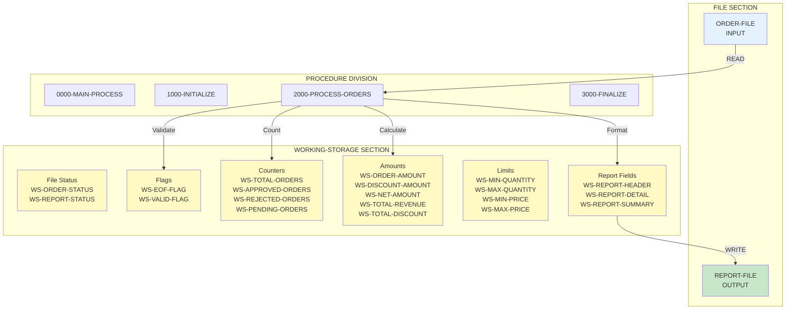
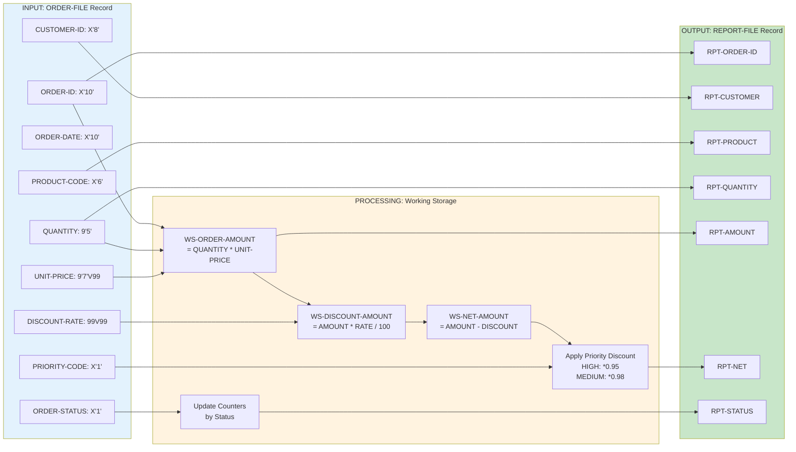
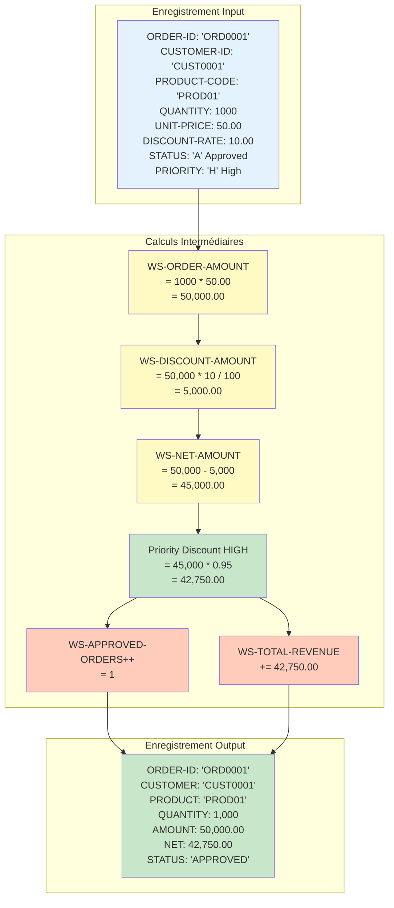
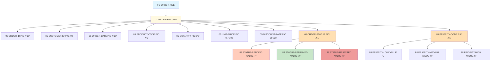
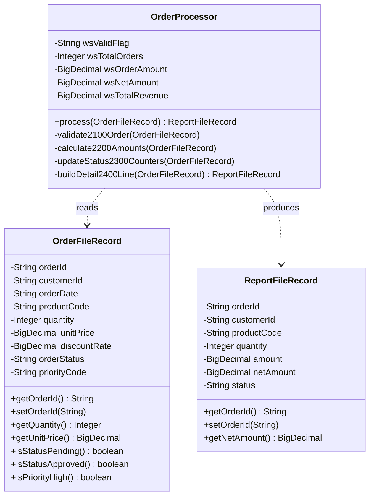
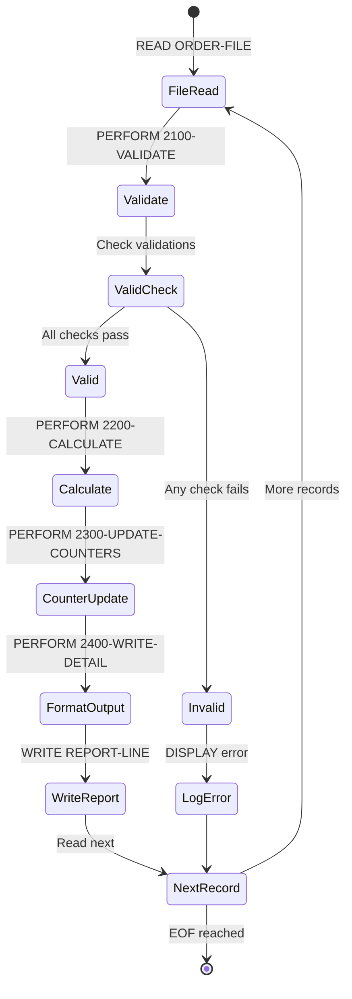
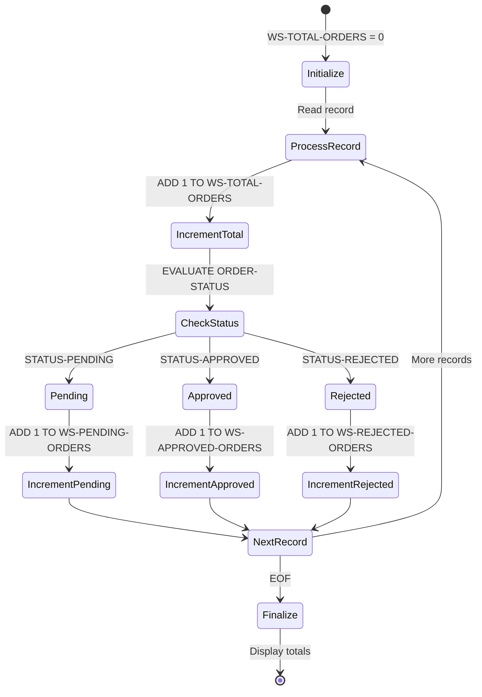
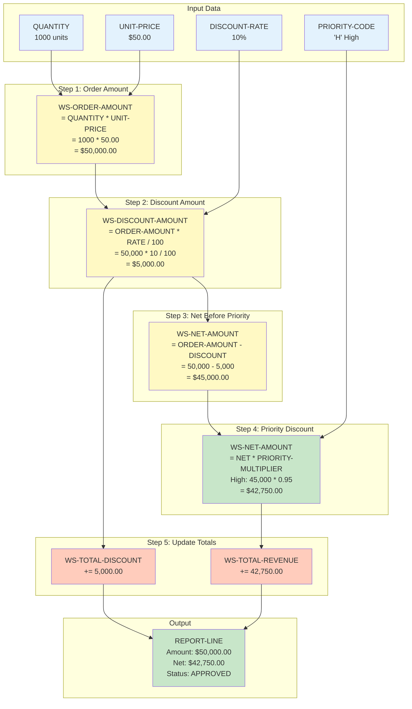
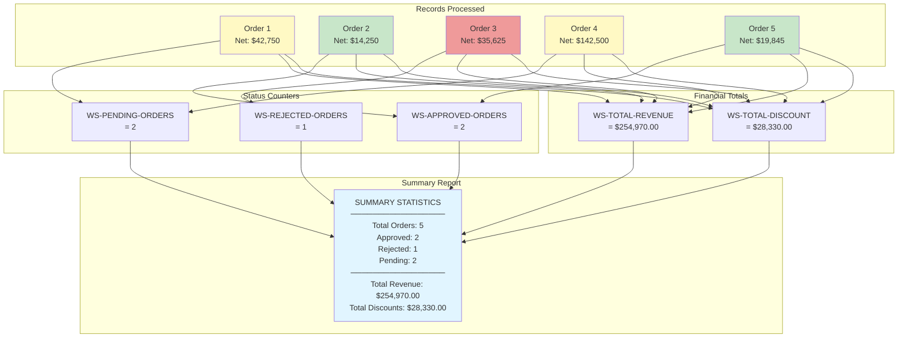

# Diagrammes de Flux de Données - ORDER-PROCESSOR

Visualisation du flux de données entre COBOL et Java Spring Batch

---

## 📊 Architecture Données - Vue d'Ensemble

### COBOL: Architecture en Couches



### Java: Architecture Spring Batch

```mermaid
graph TB
    subgraph "Model Layer"
        IM[OrderFileRecord<br/>@Entity<br/>- orderId<br/>- customerId<br/>- quantity<br/>- unitPrice<br/>- etc.]
        OM[ReportFileRecord<br/>@Entity<br/>- reportLine<br/>or detailed fields]
    end

    subgraph "Processor Layer"
        P[OrderProcessor<br/>@Component<br/>implements ItemProcessor]
        WS[Working Storage Fields<br/>- wsValidFlag<br/>- wsTotalOrders<br/>- wsOrderAmount<br/>- etc.]
        V[OrderValidator<br/>@Component<br/>Business Rules]
    end

    subgraph "Configuration Layer"
        JC[OrderJobConfiguration<br/>@Configuration]
        R[FlatFileItemReader<br/>@Bean @StepScope]
        W[FlatFileItemWriter<br/>@Bean @StepScope]
    end

    subgraph "Spring Batch Framework"
        J[Job]
        S[Step]
        SE[StepExecution]
        JR[JobRepository]
    end

    R -->|Read| IM
    IM -->|Process| P
    P <-->|Uses| WS
    P -->|Validate| V
    P -->|Transform| OM
    OM -->|Write| W

    JC -->|Configure| R
    JC -->|Configure| P
    JC -->|Configure| W
    JC -->|Define| S
    S -->|Contains| R
    S -->|Contains| P
    S -->|Contains| W
    J -->|Execute| S
    S -->|Update| SE
    SE -->|Persist| JR

    style IM fill:#e3f2fd
    style OM fill:#c8e6c9
    style P fill:#fff3e0
    style V fill:#ffccbc
    style JC fill:#f3e5f5
    style J fill:#e1bee7
```

---

## 🔄 Flux de Transformation des Données

### Transformation Record: Input → Output



### Exemple Concret de Transformation



---

## 🗂️ Structure des Données

### COBOL: Hiérarchie des Données



### Java: Modèle Objet



---

## 💾 Mappage Champs: COBOL ↔ Java

### Fichier Input

| COBOL Picture | Type COBOL | Champ Java | Type Java | Conversion |
|---------------|------------|------------|-----------|------------|
| `PIC X(10)` | Alphanum | `orderId` | `String` | Direct |
| `PIC X(8)` | Alphanum | `customerId` | `String` | Direct |
| `PIC X(10)` | Alphanum | `orderDate` | `String` | Direct (ou LocalDate) |
| `PIC X(6)` | Alphanum | `productCode` | `String` | Direct |
| `PIC 9(5)` | Numérique | `quantity` | `Integer` | parseInt() |
| `PIC 9(7)V99` | Décimal | `unitPrice` | `BigDecimal` | new BigDecimal() |
| `PIC 99V99` | Décimal | `discountRate` | `BigDecimal` | new BigDecimal() |
| `PIC X(1)` | Alphanum | `orderStatus` | `String` | Direct |
| `PIC X(1)` | Alphanum | `priorityCode` | `String` | Direct |

### Working Storage

| COBOL | Java | Utilisation |
|-------|------|-------------|
| `WS-EOF-FLAG PIC X` | *(géré par reader)* | End-of-file flag |
| `WS-VALID-FLAG PIC X` | `String wsValidFlag` | Validation result |
| `WS-TOTAL-ORDERS PIC 9(7)` | `Integer wsTotalOrders` | Counter |
| `WS-ORDER-AMOUNT PIC 9(9)V99` | `BigDecimal wsOrderAmount` | Calculated amount |
| `WS-NET-AMOUNT PIC 9(9)V99` | `BigDecimal wsNetAmount` | Net after discounts |
| `WS-TOTAL-REVENUE PIC 9(11)V99` | `BigDecimal wsTotalRevenue` | Accumulated total |

### 88-Levels (Conditions)

| COBOL | Java Équivalent |
|-------|-----------------|
| `88 STATUS-PENDING VALUE 'P'` | `record.getOrderStatus().equals("P")` |
| `88 STATUS-APPROVED VALUE 'A'` | `record.getOrderStatus().equals("A")` |
| `88 STATUS-REJECTED VALUE 'R'` | `record.getOrderStatus().equals("R")` |
| `88 PRIORITY-HIGH VALUE 'H'` | `record.getPriorityCode().equals("H")` |
| `88 PRIORITY-MEDIUM VALUE 'M'` | `record.getPriorityCode().equals("M")` |
| `88 PRIORITY-LOW VALUE 'L'` | `record.getPriorityCode().equals("L")` |

---

## 📊 Flux d'États

### Cycle de Vie d'un Enregistrement



### États des Compteurs



---

## 🔄 Transformation des Montants



---

## 📈 Agrégation des Données

### Vue Globale des Totaux



---

## 🎯 Conclusion

Ces diagrammes illustrent:

1. **Transformation complète** des données du format COBOL fixe vers objets Java
2. **Conservation de la logique** métier à travers tous les calculs
3. **Mappage 1:1** des structures de données (avec enrichissement)
4. **Flux identique** malgré des architectures différentes
5. **Traçabilité parfaite** de chaque transformation

Le convertisseur génère du code Java qui:
- ✅ Respecte la sémantique COBOL
- ✅ Utilise les types appropriés (BigDecimal pour l'argent)
- ✅ Maintient la précision des calculs
- ✅ Préserve l'ordre des opérations
- ✅ Génère le même résultat final
